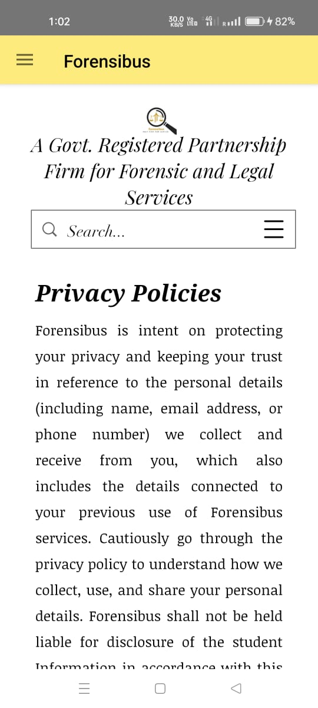

# ForensiBus

The ForensiBus app is a mobile application developed for the company ForensiBus.
It provides a convenient way to access the company's website using a WebView.

## Features
 WebView Integration: The app integrates a WebView component to display the ForensiBus website within the app.
 
Easy Navigation: Users can browse the website seamlessly through the app, accessing various pages and information.

Responsive Design: The WebView is optimized for mobile devices, ensuring a smooth and user-friendly browsing experience.

## Requirements
To run the ForensiBus app locally, you will need the following:

   Android device or emulator.
   Stable internet connection to load the ForensiBus website.

## Contributing
We welcome contributions to enhance the ForensiBus app. If you would like to contribute, please follow these steps:

Fork the repository.
Create a new branch for your feature or bug fix.
Make the necessary modifications and commit your changes.
Push your branch to your forked repository.
Submit a pull request detailing your changes and their benefits.

## License
The ForensiBus app is released under the [Apache License](https://opensource.org/license/apache-1-1/). Please review the LICENSE file for more details.

## Screenshots

